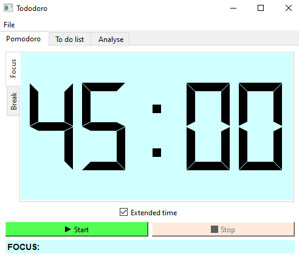

# Summary
This is Tododoro, a pomodoro timer with tracking using PostgreSQL database (with local server). 

Pomodoro Technique is a time management method developed in the 1980s for productivity. A timer is used to break work into intervals, typically 25 minutes of focused work separated by 5 minutes of short breaks, (see [Wikipedia](https://en.wikipedia.org/wiki/Pomodoro_Technique) for more details.)

Because this program has to communicate with an PostgresSQL server, knowledge of PostgreSQL is recommended in order to set up this program. This program works for Window OS.

# Setup
1. Setup PostgreSQL on your PC with a database and user account (user account must have read/write privileges to the database including the public schema)
2. Update the PostgreSQL infomation to the config.json file in the config folder (One workaround to not provide the password is to edit the "pg_hba.conf" file to enable server to trust the username)
3. Update the config.json file with the timing (in minutes) that you want, only a maximum of 59 mins is allowed
4. Run the tododoro_gui.py to start the timer app
5. Configurations can also be updated from the File > Settings menu, program has to be restarted manually for any changes made to the database settings for it to take place

*Updating postgres details in config file*: 
```
"postgres": {
        "user": "<SQL user name>",
        "pw": "<SQL user password>",
        "dbname": "<database name>"
}
```

*Updating pg_hba.conf file so no password is needed in the json file (the file may be stored at C:\Program Files\PostgreSQL\17\data)*:
```
# TYPE  DATABASE        USER            ADDRESS                 METHOD
# IPv6 local connections:
host    tododoro        python          ::1/128                 trust
host    all             all             ::1/128                 scram-sha-256
```

*Updating timing details in minutes in the config file (maximum of 59mins)*:
```
"timer": {
        "focus-short": 25,
        "focus-extended": 45, 
        "break-short": 10,
        "break-extended": 40
    }
```

*Updating configurations from the File > Settings menu*: \


# Usage
The section below contains information on the usage of the timer. When the program encounter handled exceptions (i.e. unable to establish connection to the database, etc), an error message will appear. 

## Timer 
- Tododoro has two timers "Focus" and "Break" (only one timer can be allowed at the same time)
- The timing for the timers can be set in the config.json file (refer to section above) or from the File > Settings menu, note that the maximum limit is 59mins
- The "Extended time" check box can be toggled to switch between the short timer or the extended timer 
- Timer can be paused, resumed, and stopped 
- Once the timer is stopped, an entry of the time lapsed will be added to the SQL table, and timer will be reset
- Once the timer has successfully ended, an entry will be added to the SQL table, and timer will be reset
- A beep sound will be emitted once timer has completed 

*Interface of the timer* \


## SQL Structure 
- SQL database will consist of the table named "pomodoro" 
- SQL database will consist of five columns:
  1. **duration** *INT*: duration of the timer in seconds
  2. **end_time** *TIMESTAMP WITH TIME ZONE*: the time when the timer has completed
  3. **start time** *TIMESTAMP WITH TIME ZONE*: the time when the timer has started 
  4. **task** *VARCHAR*: this column will be NULL for now 
  5. **timer_category** *timer_type*: states whether the timer is "focus" or "break"
- If the table or column(s) does not exist, it will be created by the program 
- Program will check if:
  1. The table exist, will be created otherwise
  2. Check if the enum type "timer_type" exist, will be created otherwise
  3. Check table column heading, any missing column will be created, additional columns will be ignored (Note that the column data type are NOT checked)
- Column names are hard coded, any changes to the column name will cause the program to break
- It is better to let the program create the table for you and not mess around with the columns

*Sample of the SQL pomodoro table viewed in pgAdmin* \


# Program Structure
```
|_img
  |_...
|_config
  |_config.json 
|_src
  |_db.py 
  |_overhead.py
  |_tododoro.log
|_tododoro_gui.py 
|_README.md
```
- **db.py** establishes connection to the SQL database and contains database related functions 
- **overhead.py** contains helper functions such as returning logger object to ensure consistent log formatting, and function to read the JSON config file
- **tododoro.log** log file is stored in the src/ folder, the log file is rewritten upon each program run
- **config.json** consists of configurations for the database and timers, and logfile formatting
- **img** folder consists of images for this README.md 

# Future Improvements 
Some possible improvement for this program:
- Data analytics to track productivity 
- Integrated to do list (hence the name Tododoro and the "task" column in the database table)
